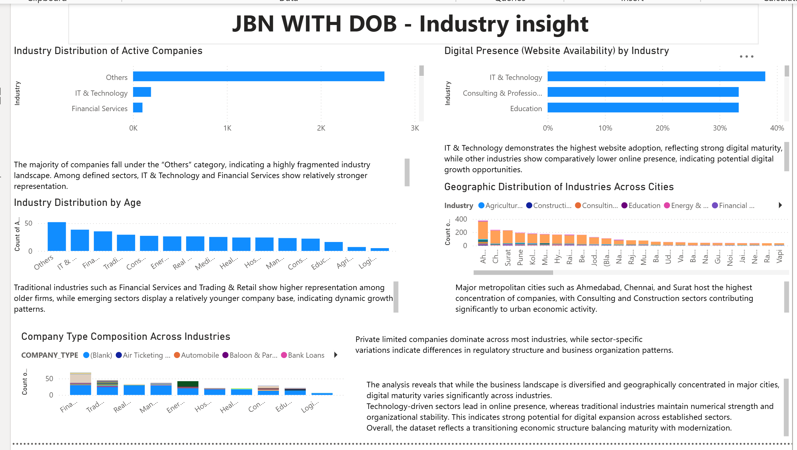
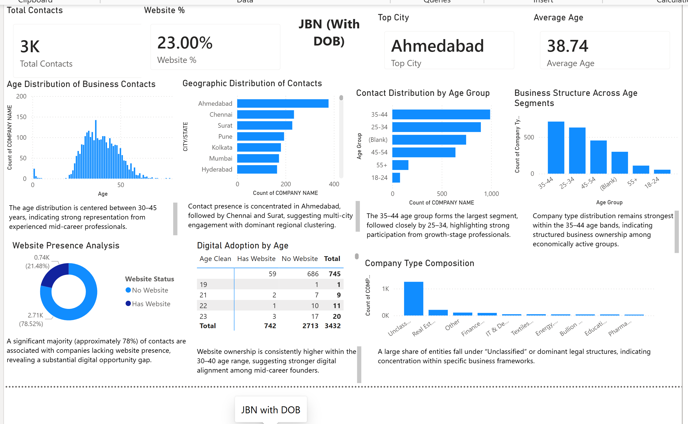
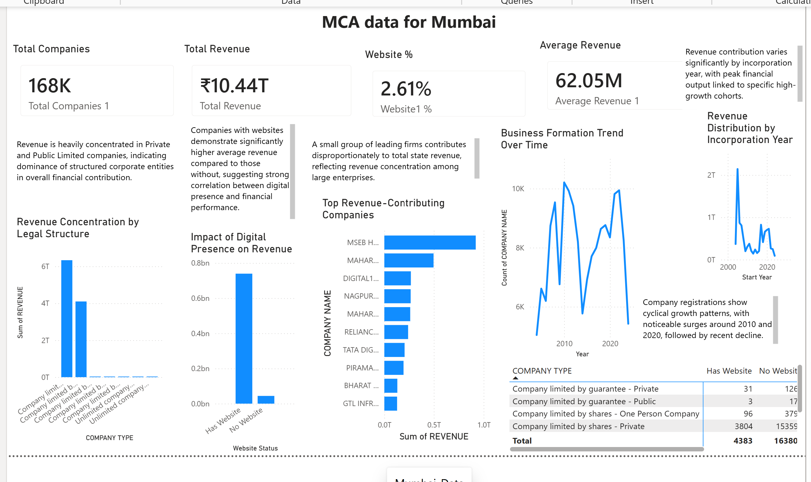
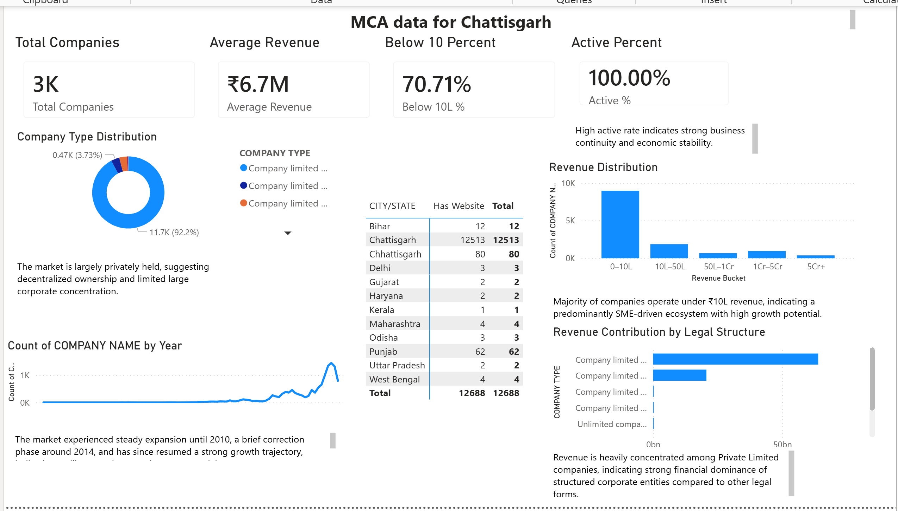

# JBN & MCA Business Insights Dashboard

An interactive Power BI project analysing business, industry, geographic, digital presence, and revenue patterns across JBN and MCA datasets.

The dashboard was created to identify business trends, compare industries, study company distribution, and explore how factors such as location, company age, legal structure, and website presence relate to business activity and revenue.

## Dashboard Highlights

The analysis covers:

- Industry distribution across businesses
- Geographic concentration of companies
- Website availability and digital adoption
- Company and contact age distribution
- Business structure and company type
- Revenue distribution across legal structures
- Business formation trends over time
- Revenue performance of companies with and without websites
- State and city-level business patterns

## Key Insights

- IT & Technology showed relatively strong website adoption compared with several other industries.
- Business activity was concentrated in major cities such as Ahmedabad, Chennai, and Surat.
- The largest contact age group was approximately 35–44 years old.
- A significant proportion of businesses in the JBN dataset did not have a website, suggesting potential opportunities for digital adoption.
- Private and structured corporate entities contributed a large share of total revenue within the MCA analysis.
- Revenue and company formation patterns varied significantly across regions and incorporation periods.

## Tools & Skills

- Microsoft Power BI
- Power Query
- DAX
- Data Cleaning
- Data Transformation
- Data Modelling
- Exploratory Data Analysis
- KPI Development
- Data Visualisation
- Geographic Analysis
- Business Intelligence

## Dashboard Screenshots

### JBN Industry Insights

### JBN Demographic & Digital Presence Analysis

### MCA Mumbai Business Analysis

### MCA Chhattisgarh Business Analysis

## Project File

The Power BI source file is not included in this public repository because the dashboard was built using externally sourced business data.

This repository focuses on the analysis, methodology, insights, and dashboard outputs.

## Data Source

The analysis was developed using business data collected from publicly available official sources for analytical and educational purposes.

Source data ownership remains with the respective data providers.

## Purpose

This project demonstrates the use of Power BI to transform business data into actionable insights through data cleaning, modelling, KPI creation, and interactive visualisation.